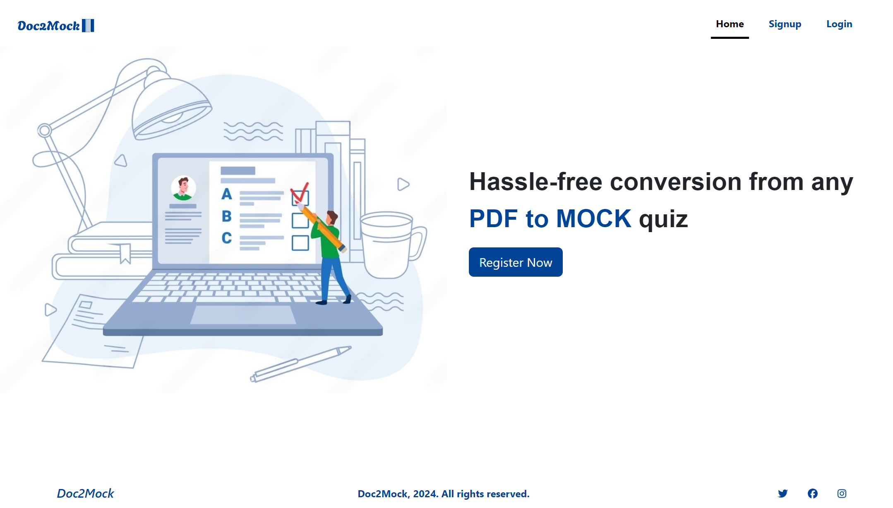
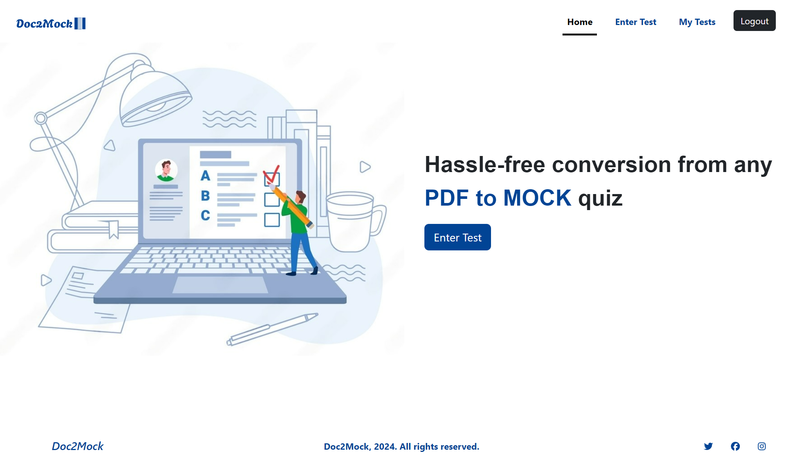
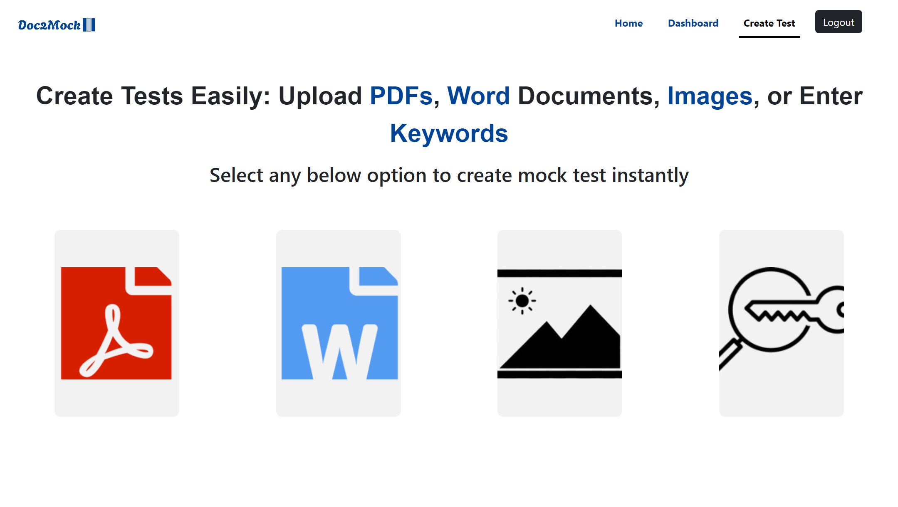
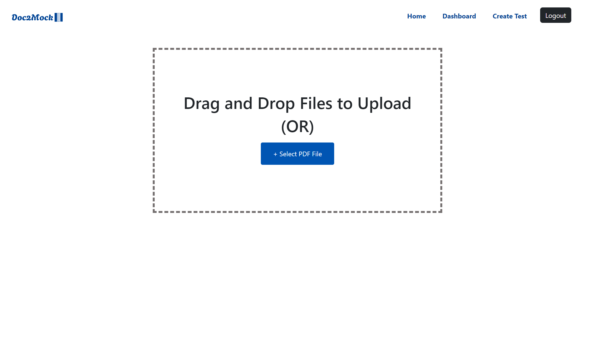
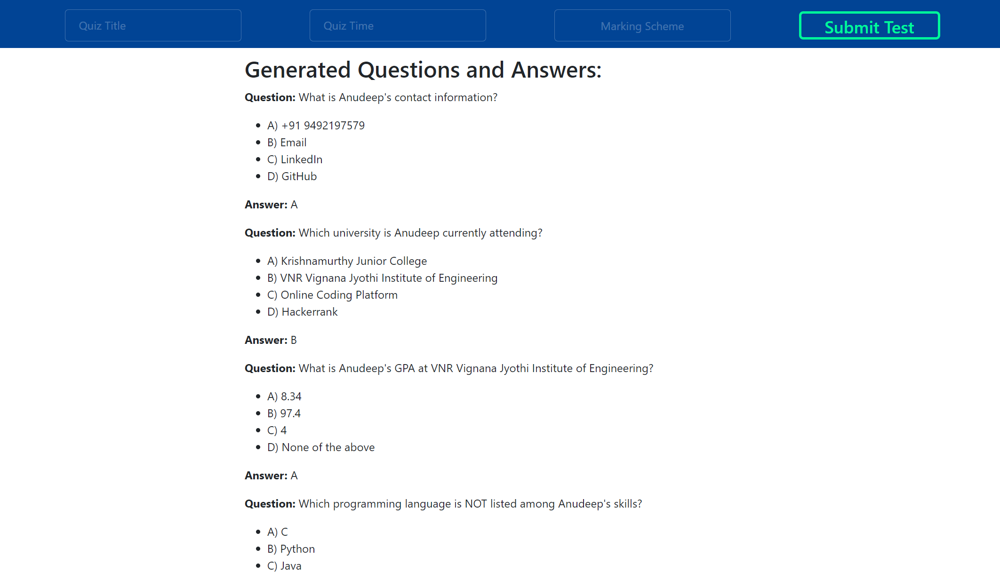
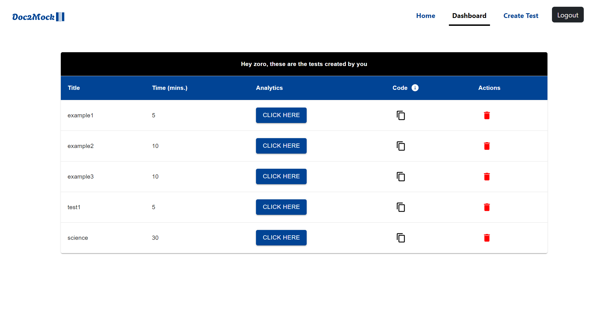
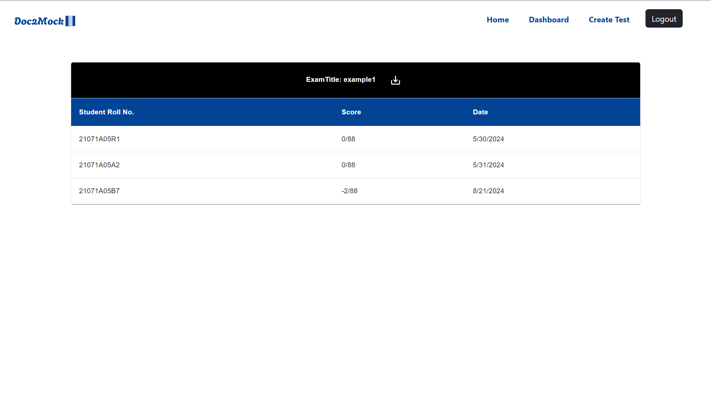
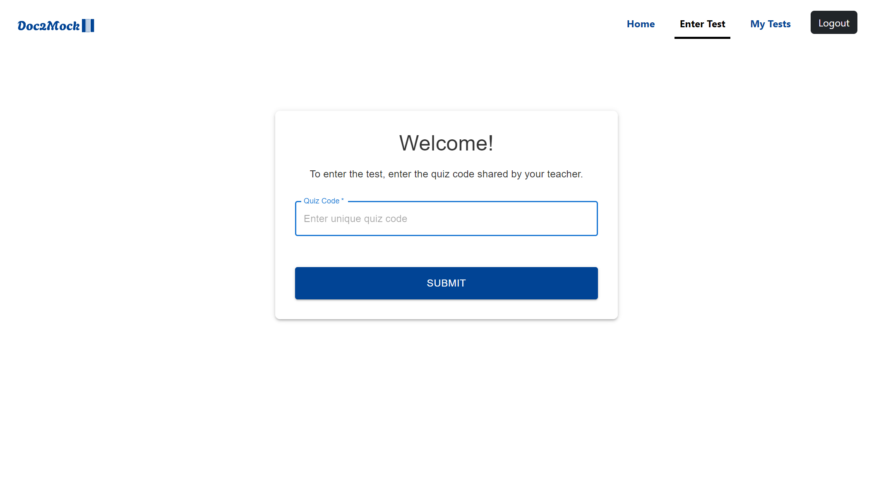
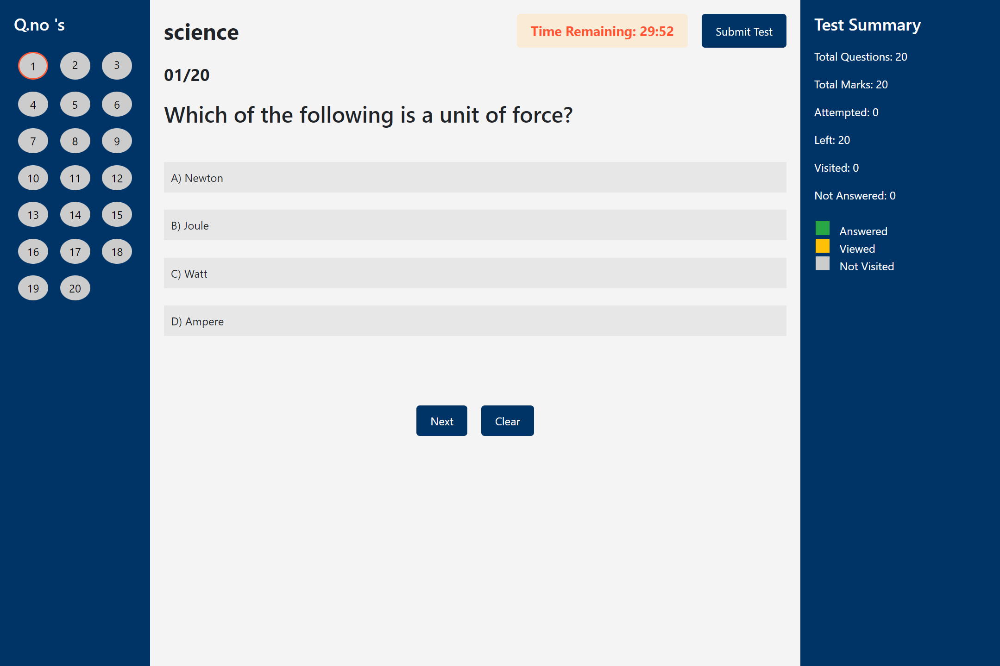
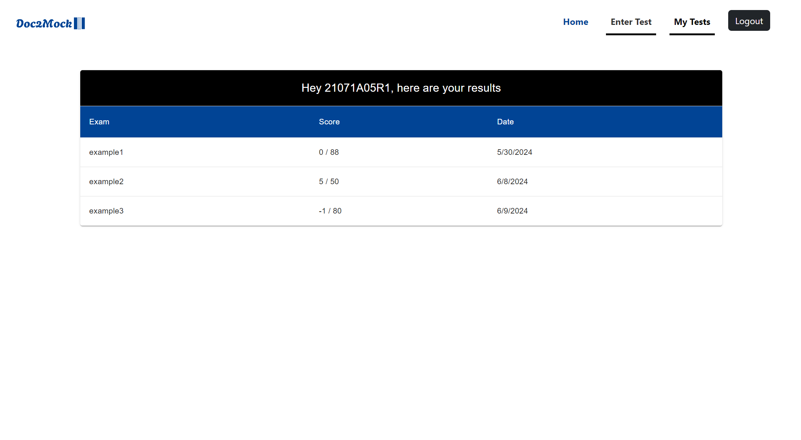

# DOC2MOCK

DOc2MOCK is a web application built using the MERN stack that converts PDF, DOC, and image files into online multiple-choice quizzes (MCQs). It provides a seamless solution for teachers to create quizzes and for students to attempt them through a generated quiz interface.

## Features

- **Teacher Uploads:** Teachers can upload PDF, DOC, or image files for quiz generation.
- **Quiz Generation:** Automatically converts the uploaded content into multiple-choice questions.
- **Student Access:** Students can access the quiz using a unique code generated by the teacher.
- **Interactive Quiz UI:** A user-friendly interface for students to attempt the quizzes.

## Tech Stack

- **Frontend:** HTML5, CSS3, JavaScript, React.js
- **Backend:** Node.js, Express.js
- **Database:** MongoDB
- **File Processing:** pdfjs (for PDF text extraction), tesseract.js

## Workflow

1. **Teacher Workflow:**
   - The teacher uploads a PDF, DOC, or image file.
   - The file is processed, and the content is automatically converted into a multiple-choice quiz.
   - A unique quiz code is generated and shared with students.

2. **Student Workflow:**
   - Students enter the quiz using the code shared by the teacher.
   - They attempt the quiz through a dynamic and interactive user interface.
   - Upon completion, results are stored and can be reviewed by the teacher.

## Screenshots

### Home Page

### Registration Page

### Login Page

### Teacher Home Page

### Create Quiz Page

### Upload Quiz Content Page

### Display Uploaded Quiz

### Teacher Quiz List Page

### Quiz Results Page (Teacher View)

### Student Home Page

### Student Enter Quiz Page

### Student Quiz Display Page

### Student Quiz Results Page

